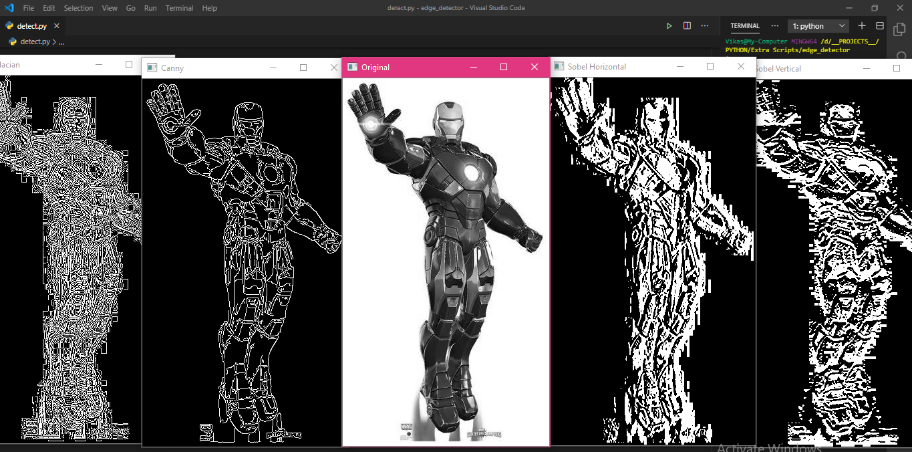

## Edge Detect From Object 
 ---
 Edge detection is an image processing technique for finding the boundaries of objects within images. It works by detecting discontinuities in brightness.
 This is the project that showing hwo to convert image into a gray-scale images. And convert it into small and tiny images, This section can help us to Object Detection easly and faster than colored object detection process.
 
 
 

 

 
